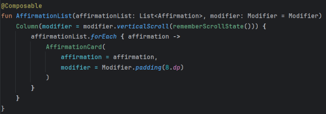

# Programming Portfolio - First Set of Exercises

*Please complete this document to confirm the work that has been done. You will also add your answers to the provided 
questions in the space provided*

Please replace ${\color{green}-- todo}$ with ${\color{blue}-- completed}$ once done.\
\
Include an appropriate screenshot from your application to confirm completion. Screenshots should be added to 
the /images folder in the top-level repo.\
\
Include the provided question for your exercise and your answer in the space provided.

---

### Happy Birthday ###

|   **First Part ${\color{green}-- todo}$**    |    **Extension ${\color{green}-- todo}$**    |
|:--------------------------------------------:|:--------------------------------------------:|
|  |  |

#### Question ####
> The Birthday/Christmas Example is localised to the English language. What changes would need to be done 
> to make this app localised for the **Spanish** language.
> 
> https://developer.android.com/guide/topics/resources/localization 
> 
> How would you test that your localised app worked as expected on the emulator? 
>
> Please include a screenshot of the new version working as part of the answer. 
> 
> My own example with German language translation is shown below. 
> 
>  
> 
> Make sure to add a final commit to your birthday branch with the amended code.

#### Answer ####
> *Please provide your answer in this space*
> 
> 
> 
> 

---
### Quadrants ###

|    **First Part ${\color{green}-- todo}$**    |    **Extension ${\color{green}-- todo}$**     |
|:---------------------------------------------:|:---------------------------------------------:|
|  |  |

#### Question ####
> In the quadrants exercise, the layout of 2x2 has no issues on an orientation change. 
> However, consider the impact a 3x2 in portrait would have when orientated. 
> Is the preference for it to remain 3x2?
> 
> Typically, layouts *adapt* to meet user expectations. 
> 
>  
>  
> For this question, please provide an answer indicating how this would be done using *Composables*.
> You should include in the answer the specific code elements that are aware of the device orientation.
> A good place to start is **androidx.compose.ui.platform**
> 
> To further demonstrate your knowledge of the answer - include a screenshot of a modified version
> of your quadrants to handle a 3x2 to 2x3 switch. Add as a final commit to your quadrants branch.
> 

#### Answer ####
> *Please provide your answer in this space*
> 
> 
> 
> 

---

### Woof ###

| **First Part ${\color{green}-- todo}$**  |  **Extension ${\color{green}-- todo}$**  |
|:----------------------------------------:|:----------------------------------------:|
|  |  |

#### Question ####
> Woof displays a list of Cards. The Material 3 API offers several card definitions.
> 
> https://developer.android.com/reference/kotlin/androidx/compose/material3/package-summary
> 
> Having looked at this documentation, please list the changes that will need to be made to produce 
> the following effect on a card - a pressed state that removes a dropped shadow. See the screenshot, 
> this shows an elevated default state with a raised shadow and a pressed state with no elevation.
> 
> 
>  
> While this type of material change is the default behaviour for a Pressed State, how could this be overriden
> so that a border is added on the Pressed state.
> 
>  
> 
> Useful information can be found at:
> 
> https://developer.android.com/develop/ui/compose/touch-input/user-interactions/handling-interactions
> 
> Please add an additional commit to your woof branch and include a screenshot similar to the one shown. 
> Please note the the colour of your card is unimportant and you should just use the card colours that you 
> currently have in your project.
>  

#### Answer ####
> *Please provide your answer in this space*
> 
> 
> 
> 

---

### Affirmations ###

|     **First Part ${\color{green}-- todo}$**     |     **Extension ${\color{green}-- todo}$**      |
|:-----------------------------------------------:|:-----------------------------------------------:|
|  |  |

#### Question ####
> In the documentation for Compose and LazyColumn, there is the paragraph:
> 
> https://developer.android.com/jetpack/compose/lists
> 
> “If you need to display a large number of items (or a list of an unknown length), using a 
> layout such as *Column* can cause performance issues, since all the items will be composed and 
> laid out whether or not they are visible.”
> 
> Using the LayoutInspector tool and the Affirmation example further explain the above statement. 
> It is expected that your included answer will include a screenshot from the LayoutInspector tool 
> that shows the issue with using Column rather than LazyColumn for long lists.
> 
> Layout Inspector is a tool inside of Android Studio that will show live views from the emulator
>
> https://developer.android.com/studio/debug/layout-inspector
> 
> HINT: You will need to change the composable for the Affirmation example to: 
>  
>  

#### Answer ####
> *Please provide your answer in this space*
> 
> 
> 
> 

---

